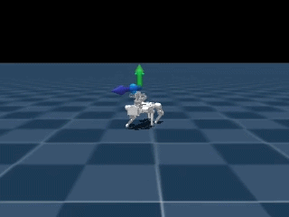
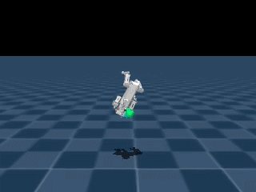

# luwu_mjlab

**luwu_mjlab** 是 [陆吾智能（Luwu Dynamics）](https://www.xgorobot.com/) 的强化学习训练环境，基于 MuJoCo 仿真训练四足机器人（XGOMini）的运动控制策略。

底层框架 **[mjlab](https://github.com/mujocolab/mjlab)** v1.2.0，融合 Isaac Lab 风格 API 与 GPU 加速的 MuJoCo Warp。本项目在其基础上扩展了陆吾机器人模型和任务配置。

## 效果预览

| 仿真 | 实机 |
|------|------|
|  |  |
|  |  |

## 安装

### Linux（Ubuntu 22.04）

系统要求：NVIDIA GPU + 驱动 550+ + Python 3.11。

```bash
conda create -n luwu_mjlab python=3.11
conda activate luwu_mjlab
git clone https://github.com/LuwuDynamics-RIG/luwu_mjlab.git
cd luwu_mjlab
pip install -e .
```

验证：

```bash
python scripts/list_envs.py --keyword XGOMini
python scripts/play.py XGOMini-Flat --agent zero
```

训练：

```bash
python scripts/train.py XGOMini-Flat --env.scene.num-envs=4096
tensorboard --logdir logs/rsl_rl/xgomini_velocity
```

### Windows

前置条件：Windows 10/11 + NVIDIA GPU（≥RTX 20xx）+ ≥16 GB 内存。

**1. 安装 NVIDIA 驱动**

要求 ≥ R570。下载：https://www.nvidia.com/en-us/drivers/ ，选快速安装，重启。

```powershell
nvidia-smi   # 验证：应显示驱动版本、CUDA UMD ≥13.0
```

**2. 安装 Miniconda**

下载：https://docs.anaconda.com/miniconda/install/#windows-installers ，勾选 "Just Me" + "Add to PATH"。新终端验证 `conda --version`。

**3. 创建环境 + 安装 CUDA + PyTorch + 项目**

```cmd
conda create -n luwu_mjlab python=3.11
conda activate luwu_mjlab
conda install -c nvidia cuda-toolkit=13.0.2 cudnn
pip install torch torchvision --index-url https://download.pytorch.org/whl/cu130
cd <项目根目录>
pip install -e .
```

验证 CUDA：`nvcc --version`（应输出 release 13.0）。
验证 PyTorch：`python -c "import torch; print(torch.cuda.is_available())"`（应输出 True）。

**4. 冒烟测试**

```cmd
python scripts/play.py XGOMini-Flat --agent zero --num-envs 4
```

> **warp-lang 必须 <1.14**，因 mjlab 1.2.0 依赖 `wp.context.runtime`，新版本已移除该 API。

常见问题：
- CUDA 不可用 → 检查驱动 + `nvidia-smi`
- warp 初始化失败 → `pip show warp-lang` 确认版本 1.12.1
- DLL 加载失败 → 确保 `%CONDA_PREFIX%\Library\bin` 在 PATH 前面

彻底重装：

```cmd
conda deactivate && conda remove -n luwu_mjlab --all
conda create -n luwu_mjlab python=3.11 && conda activate luwu_mjlab
conda install -c nvidia cuda-toolkit=13.0.2 cudnn
pip install torch==2.12 torchvision --index-url https://download.pytorch.org/whl/cu130
cd <项目根目录> && pip install -e .
```

## 训练

```bash
python scripts/train.py <任务ID> [--覆盖参数...]

示例:
python scripts/train.py XGOMini-Flat --env.scene.num-envs 4096
```

CLI 两阶段解析：第一参数选任务 → 剩余参数覆盖 `TrainConfig`（冻结数据类：`env` + `agent`）。

执行流程：`main() → launch_training() → run_train()`。单卡直接运行，多卡通过 `torchrunx` 分发。

常用参数：

| 参数 | 说明 |
|---|---|
| `--env.scene.num-envs 4096` | 并行环境数 |
| `--agent.max-iterations 10000` | 训练迭代数 |
| `--agent.resume` | 从最新检查点恢复（regex 匹配） |
| `--motion-file <路径>` | 跟踪任务必填 |
| `--video` | 录制训练视频 |
| `--gpu-ids all` / `[0,1]` | GPU 选择 |


## 验证

```bash

# 加载最新检查点
python scripts/play.py XGOMini-Flat

通过web网页查看模拟效果，浏览器通过 http://localhost:8080 地址访问
╭────── viser (listening *:8080) ───────╮
│             ╷                         │
│   HTTP      │ http://localhost:8080   │
│   Websocket │ ws://localhost:8080     │
│             ╵                         │
╰───────────────────────────────────────╯

# 指定检查点
python scripts/play.py XGOMini-Flat \
  --checkpoint-file logs/rsl_rl/xgomini_velocity/2026-xx-xx_xx-xx-xx/model_xx.pt

# MDP 健全性检查（零动作静止，无需检查点）
python scripts/play.py XGOMini-Flat --agent zero
```

## 项目架构

```
scripts/
  train.py              # 训练入口 (RSL-RL PPO)
  play.py               # 推理/评估入口
  list_envs.py          # 列出已注册任务
  visualize_terrain.py  # 地形预览

src/
  assets/robots/xgomini/  # MJCF XML、STL/DAE 网格、配置常量
  assets/motions/          # 跟踪任务参考动作文件 (.npz)
  tasks/
    __init__.py            # import_packages() 自动扫描注册
    velocity/              # 速度跟踪运动任务
      velocity_env_cfg.py           # make_velocity_env_cfg() 工厂
      config/xgomini/
        env_cfgs.py                 # rough / flat 环境配置
        rl_cfg.py                   # PPO 超参数
      mdp/                          # observations, rewards, terminations, curriculums, commands
      rl/runner.py                  # VelocityOnPolicyRunner (ONNX 导出)
    tracking/              # 动作模仿跟踪任务（结构同 velocity/）
```

## 关键依赖

Python **3.11**，全部锁定版本（`setup.py`）：
| 包 | 版本 | 说明 |
|---|---|---|
| `mjlab` | 1.2.0 | RL 环境框架 |
| `mujoco` | 3.6.0 | 物理引擎 |
| `mujoco-warp` | 3.6.0 | GPU 加速 MuJoCo |
| `warp-lang` | 1.12.1 | GPU 计算 DSL（必须 <1.14） |
| `scipy` | ≥1.17.0 | 科学计算 |


## 日志与检查点

- 路径：`logs/rsl_rl/<实验名>/<时间戳>/`；检查点：`model_<迭代数>.pt`
- 配置 YAML 写入 `params/`（恢复时跳过）
- 默认 `MjlabOnPolicyRunner`，`VelocityOnPolicyRunner` 额外支持 ONNX 导出 + wandb

## 相关链接

- [陆吾智能官网](https://www.xgorobot.com/)
- [mjlab 官方仓库](https://github.com/mujocolab/mjlab)
- [mjlab 文档](https://mujocolab.github.io/mjlab/)
